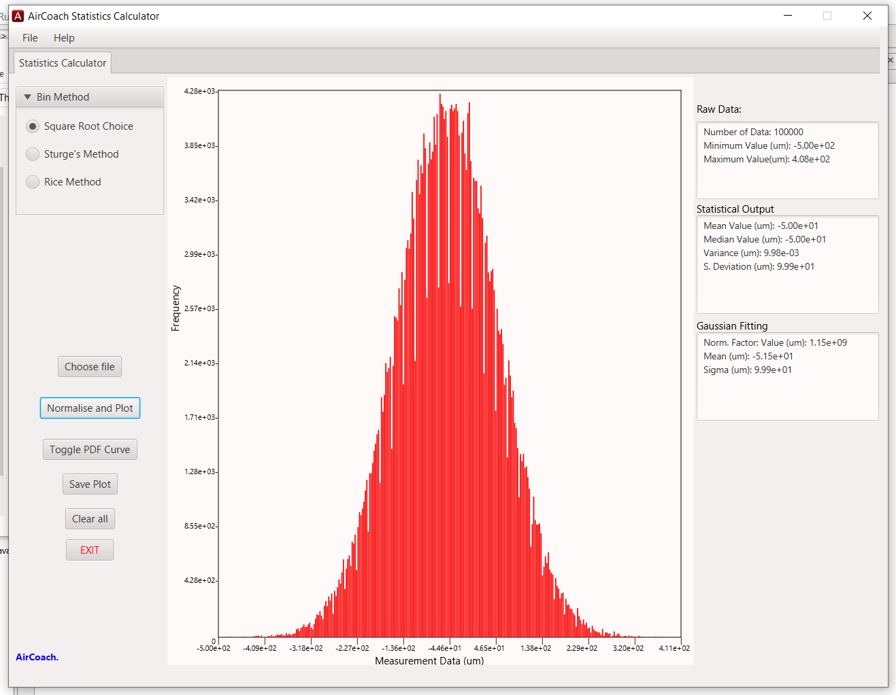
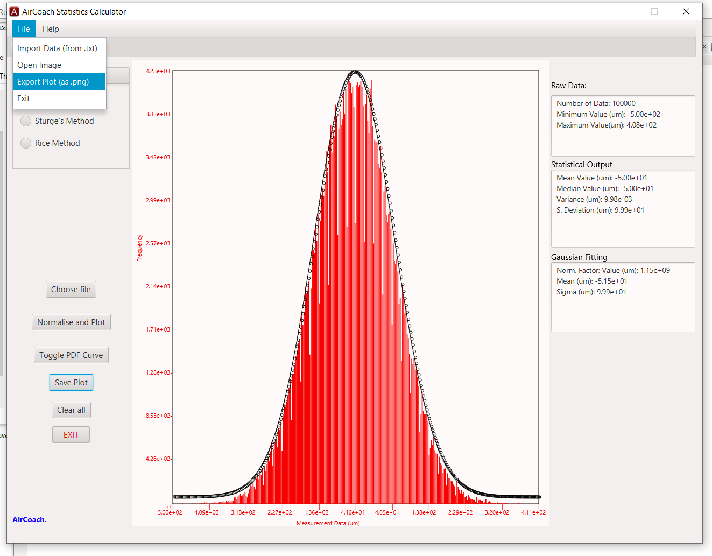
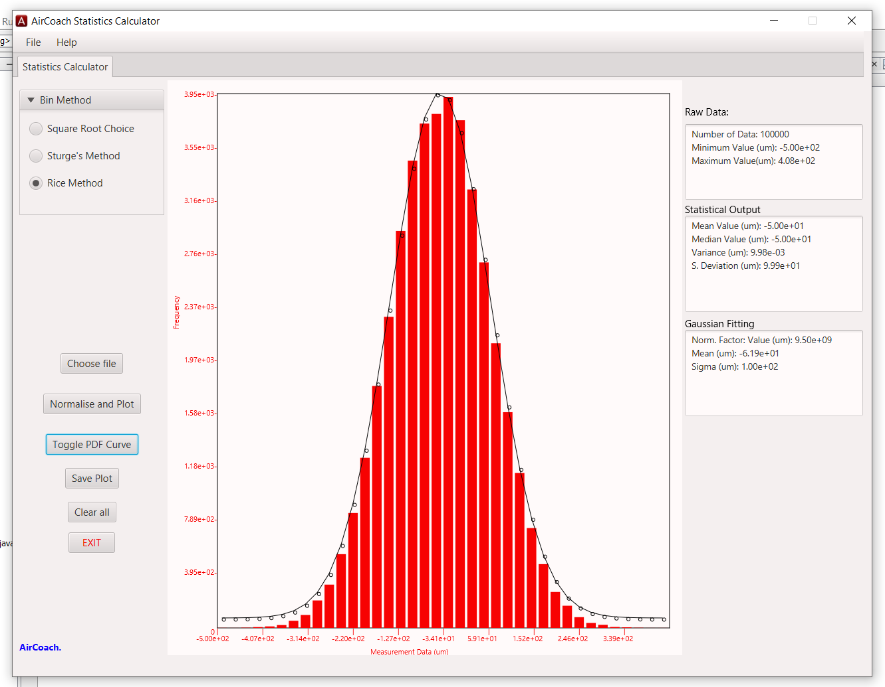

## StatisticsCalculator

The Statistics Calculator does data analysis on an ungrouped set of data, and outputs its analysis results to its simple user-friendly GUI as can be seen below including a histogram plot for the data and a Probability Density Function Curve along the edges of the histogram. Data is imported in a .txt file.

# Histogram

# Histogram with Probability Density Function Curve (Gaussian Curve)

# Varied Bin size depending on data

